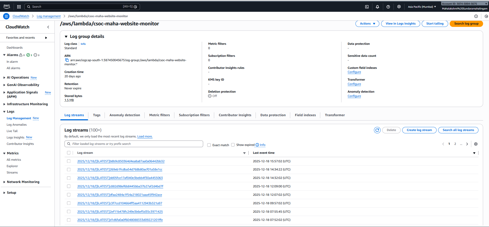

# Project 3 — Cloud Security & Observability Command Center

AWS Cloud Project | Level: Cloud Practitioner  
Status: Completed | License: MIT

---

## 📑 Table of Contents

- [Overview](#overview)
- [Architecture](#architecture)
- [What You Will Build](#what-you-will-build)
- [AWS Services Used](#aws-services-used)
- [Project Structure](#project-structure)
- [Deployment Steps](#deployment-steps)
- [Key Deliverables](#key-deliverables)
- [Security Best Practices](#security-best-practices)
- [Output Screenshots](#output-screenshots)
- [Future Enhancements](#future-enhancements)
- [License](#license)
- [Author](#author)

---

## 📌 Overview

This project implements a **Cloud Security & Observability Command Center** using AWS native services to monitor application health, detect security violations, and store audit results for analysis.

The solution provides:
- Real-time monitoring via CloudWatch Dashboards
- Automated checks using AWS Lambda
- Alerting through CloudWatch Alarms
- Persistent audit storage using DynamoDB

This project demonstrates hands-on experience with **monitoring, alerting, automation, and security observability** in AWS.

---

## 🏗 Architecture

**High-level flow:**

1. CloudWatch Metrics and Logs monitor application and security events
2. Event-driven AWS Lambda functions process monitoring data
3. Lambda writes audit results to DynamoDB
4. CloudWatch Alarms trigger alerts for anomalies
5. Centralized CloudWatch Dashboard provides visibility

📄 Detailed architecture explanation:  
👉 `architecture.md`

---

## 🚀 What You Will Build

- Centralized CloudWatch monitoring dashboard
- Automated Lambda-based security and health checks
- CloudWatch Alarms for latency, downtime, and IAM violations
- DynamoDB table for storing audit and security results
- End-to-end observability command center

---

## ☁️ AWS Services Used

| Service | Purpose |
|-------|--------|
| Amazon CloudWatch | Monitoring, dashboards, logs, alarms |
| AWS Lambda | Automated security & health checks |
| Amazon DynamoDB | Stores audit and violation records |
| Amazon EventBridge | Event-driven automation |
| AWS IAM | Secure permissions and access control |

---

## 📂 Project Structure
```
project-3-cloud-security-observability/
├── README.md
├── architecture.md
├── steps.md
├── notes.md
└── screenshots/
├── dashboards/
│ ├── screenshotscloudwatch-dashboard-1.png
│ └── screenshotscloudwatch-dashboard-2.png
├── lambda-logs/
│ ├── screenshotslambda-logs.png
│ └── screenshotslambda-executionlogs.png
├── cloudwatch-alarms/
│ └── screenshotscloudwatch-alarms.png
└── dynamodb-audit-records/
└── screenshotsdynamodb-audit-records.png
```

---

## 🛠 Deployment Steps

📄 Complete step-by-step AWS Console guide:  
👉 `steps.md`

This includes:
- Creating CloudWatch dashboards and metrics
- Configuring Lambda functions
- Setting up EventBridge triggers
- Creating CloudWatch alarms
- Creating DynamoDB tables for audit storage
- Validating logs, alarms, and metrics

---

## 📦 Key Deliverables

- CloudWatch command center dashboard
- Automated Lambda monitoring functions
- Active CloudWatch alarms
- DynamoDB audit records
- End-to-end security observability workflow

---

## 🔐 Security Best Practices

- Least-privilege IAM roles for Lambda
- No hardcoded credentials
- Event-driven automation (no manual execution)
- Monitoring and alerting for abnormal behavior
- Audit data persisted securely in DynamoDB

---

## 📸 Output Screenshots

### 📊 CloudWatch Dashboards


---

### 🧠 Lambda Execution Logs



---

### 🚨 CloudWatch Alarms


---

### 🗄 DynamoDB Audit Records


---

## 🔮 Future Enhancements

- SNS notifications for alarms
- Advanced security rules and anomaly detection
- CI/CD automation for Lambda deployments
- Infrastructure as Code (Terraform or CloudFormation)
- Multi-account security monitoring

---

## 📜 License

This project is licensed under the **MIT License**.  
Free to use for learning and portfolio purposes.

---

## 👩‍💻 Author

**Mahalakshmi Sundara Mahalingam**  
AWS Certified Cloud Practitioner


