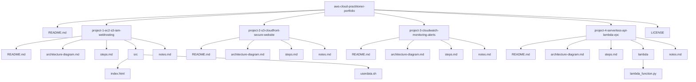

# AWS Cloud Practitioner Portfolio

A hands-on **Cloud & Linux portfolio** demonstrating real-world AWS fundamentals,  
serverless architectures, cloud security & observability, and Git/Linux workflows.

This repository is aligned with **entry-level Cloud / DevOps / Cloud Operations roles**.

---

## 👩‍💻 About Me

**Mahalakshmi Sundara Mahalingam**  
Cloud Engineer (Entry level) 

- AWS Certified Cloud Practitioner with hands-on AWS projects  
- Strong foundation in **AWS, Linux, Git/GitHub, monitoring, and security**  
- Transitioning from a non-IT background into Cloud Engineering

📧 **Email**:  
[lakshmisundar2020@gmail.com](mailto:lakshmisundar2020@gmail.com)

🔗 **LinkedIn**:  
https://www.linkedin.com/in/mahalakshmi-profile

---

## 📑 Table of Contents

- [Projects Overview](#projects-overview)
- [Project 1 — Website Deployment](#project-1--personal-portfolio-website-deployment-aws-s3--cloudfront)
- [Project 2 — Serverless API](#project-2--serverless-vpc-api-private-lambda--api-gateway)
- [Project 3 — Cloud Security & Observability](#project-3--cloud-security--observability-command-center)
- [Project 4 — Linux Notes Tracker](#project-4--linux-notes-tracker-with-git--github)
- [Skills Demonstrated](#skills-demonstrated)
- [Certifications](#certifications)
- [License](#license)

---

## 📁 Repository Structure

---

## 📦 Projects Overview

| # | Project | Focus Area | Link |
|---|--------|-----------|------|
| 1 | Website Deployment | AWS S3, CloudFront | [View](project-1-s3-cloudfront-portfolio) |
| 2 | Serverless API | Lambda, API Gateway, VPC | [View](project-2-serverless-vpc-api) |
| 3 | Security & Monitoring | CloudWatch, IAM, DynamoDB | [View](project-3-cloud-security-observability) |
| 4 | Linux & Git | Linux CLI, GitHub | [View](project-4-linux-notes-tracker) |

---

# Project 1 — Personal Portfolio Website Deployment (AWS S3 + CloudFront)

**Description**  
Designed and deployed a **static personal portfolio website** using Amazon S3 and CloudFront  
for secure, scalable, and cost-efficient content delivery.

**Key Highlights**
- Private S3 bucket with CloudFront Origin Access Control (OAC)
- HTTPS enforced
- Secure static hosting
- AWS Free Tier compliant

📂 **Project Folder**  
👉 [project-1-s3-cloudfront-portfolio](project-1-s3-cloudfront-portfolio)

---

# Project 2 — Serverless VPC API (Private Lambda + API Gateway)

**Description**  
Built a **secure serverless API** where AWS Lambda runs inside **private VPC subnets**  
and is securely exposed through API Gateway.

**Key Highlights**
- Lambda inside private subnets
- No Internet Gateway or NAT Gateway
- VPC Interface Endpoints for CloudWatch
- Secure HTTPS access

📂 **Project Folder**  
👉 [project-2-serverless-vpc-api](project-2-serverless-vpc-api)

---

# Project 3 — Cloud Security & Observability Command Center

**Description**  
Implemented a **Cloud Security & Observability Command Center** to monitor system health,  
detect security anomalies, and store audit results.

**Key Highlights**
- CloudWatch dashboards & alarms
- Lambda-based automation
- Event-driven monitoring (EventBridge)
- DynamoDB audit records

📂 **Project Folder**  
👉 [project-3-cloud-security-observability](project-3-cloud-security-observability)

---

# Project 4 — Linux Notes Tracker with Git & GitHub

**Description**  
Created a **Linux documentation project** to track Linux commands and concepts  
using Git and GitHub.

**Key Highlights**
- Linux CLI usage
- Markdown documentation
- Git version-control workflow
- Portfolio-ready project structure

📂 **Project Folder**  
👉 [project-4-linux-notes-tracker](project-4-linux-notes-tracker)

---

## 🧠 Skills Demonstrated

### ✔ Compute
- Amazon EC2 (Linux-based hosting)
- Apache Web Server
- AWS Lambda (Serverless compute)

### ✔ Storage
- Amazon S3 buckets
- Static website hosting
- Secure private buckets with policies

### ✔ Networking
- Amazon CloudFront (CDN)
- Virtual Private Cloud (VPC)
- Private subnets
- API Gateway HTTPS endpoints

### ✔ Security
- AWS IAM users and roles
- IAM execution roles
- Least-privilege access control
- S3 bucket policies
- Secure service-to-service permissions

### ✔ Monitoring & Alerts
- Amazon CloudWatch metrics
- CloudWatch logs
- EC2 CPU utilization alarms
- SNS email notifications
- Basic observability dashboards

---

## 🎯 Learning Outcomes

- Practical AWS console experience
- Real-world cloud architecture understanding
- Secure and monitored deployments
- Strong Linux + Git fundamentals
- Documentation-driven development
- Portfolio-ready cloud projects

---

## 🎓 Certifications

- **AWS Certified Cloud Practitioner (CLF-C02)** - Score: **967 / 1000**
- AWS re/Start Graduate (TNSDC)
- Multi-Cloud Workshop
- Multi-Cloud + DevOps with AI Bootcamp

---

## 📜 License

This repository is licensed under the **MIT License**.  
Free to use for learning and portfolio purposes.

⭐ *Recruiters: Each project folder contains detailed README, architecture diagrams, deployment steps, and notes.*
